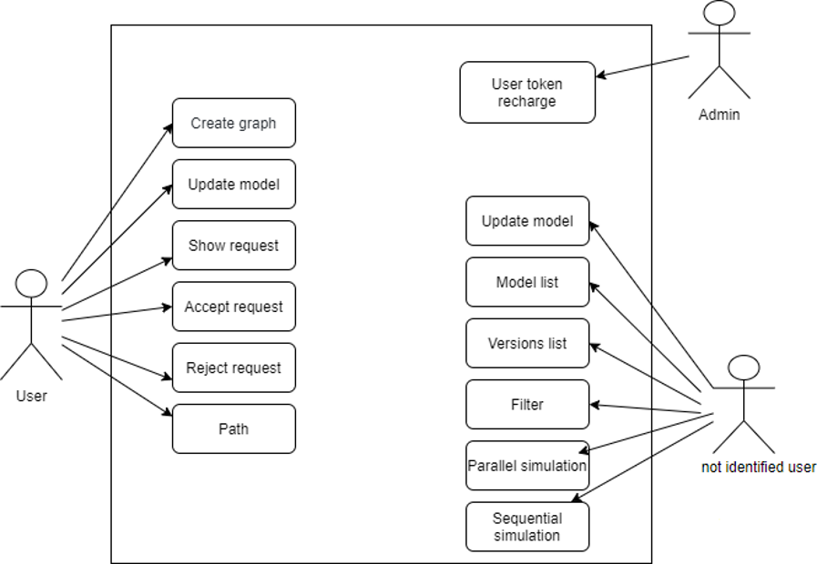
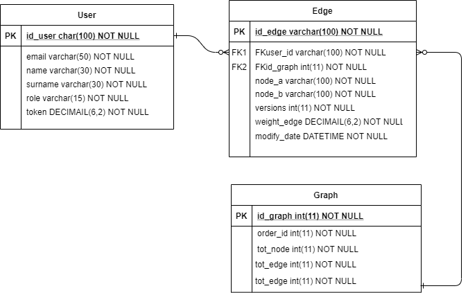
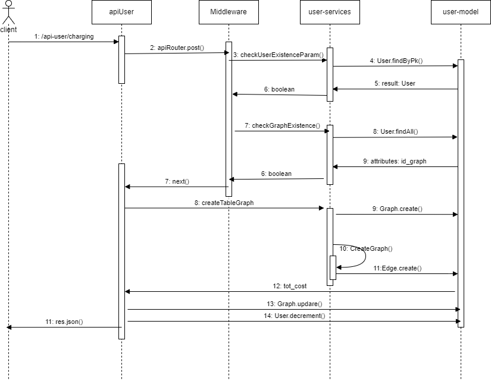
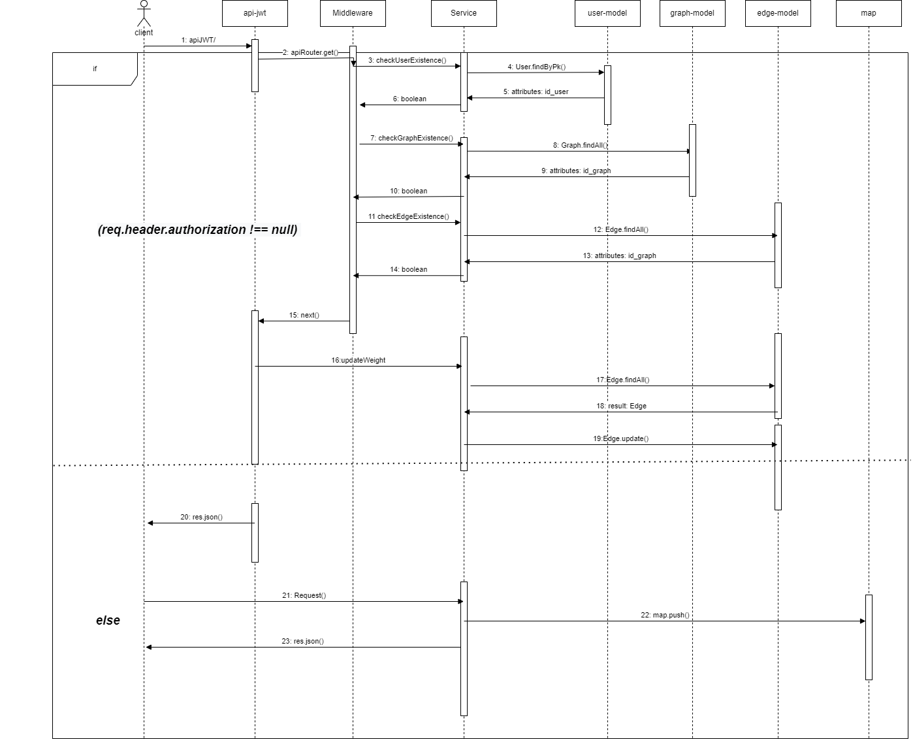

# Project PA crowd sourcing
  Miccini, Pesaresi
  
## Obiettivo del progetto
Back-end per la realizzazione di un servizio che consente digestire la creazione e valutazione di modelli di ottimizzazione su grafo.
Il progetto simula un modello crownd sourcing, che consente a un insieme di utenti di contribuire all'aggiornamento di uno o più modelli.

In particolare, il sistema prevede la possibilità di:
* Creare una nuovo modello ( in particolare vengono decrementati 0,25 token per ogni nodo e 0,01 token per ogni arco del grafo)
* Eseguire il modello, e quindi calcolare il costo di un percorso, specificando il nodo di partenza, il nodo di arrivo e il passo di incremento
* Eseguire operazioni di aggiornamento, su uno o più archi, utilizzando una media esponenziale
* Nel caso in cui un utente non sia autenticato la richiesta di aggiornamento viene messa in lista. L'utente che ha creato il modello sarà poi in grado di accettare o rifiutare le richieste di update.
* Visualizzare l'elenco delle revisioni dei pesi di un dato modello eventualmente filtrando per:
    -	Data modifica
    -	Arco
* Visualizzare l’elenco dei modelli filtrando per:
    -	Numero di nodi
    -	Numero di archi
* Ricaricare un dato utente da parte di un utente Admin
* SImulare l'esecuzione di un modello, specificando punto di inizio, di fine e passo di incremento di uno o più archi

## Progettazione

### Diagrammi UML 
#### Diagramma dei casi d'uso

Tramite un diagramma "Use case" sono rappresente le relazioni tra gli utenti e le sue richieste.
Esistono 2 tipi di utenti:
* Admin, che può ricaricare il portafoglio di un dato utente
* User, che può creare o modificare un modello.

#### Schema ER

Il database è composto da 3 tabelle:
* USER: contiente tutte le informazioni relative all'utente ed ha come chiave primaria l'id dell'utente.
* EDGE : contiene tutte le informazioni relative agli archi di ogni grafo ed ha come chiama primaria l'id dell'edge, mentre le chiavi esterna (che riguardano il creatore del modello e al grafo di appartenenza di ogni arco) fanno rispettivamente riferimento allo id_user nella tabella User e id_graph in Graph.
* GRAPH: contiene informazioni relative ai modelli.

### Diagramma delle sequenze

Vengono riportati alcuni diagrammi delle sequenze per descrivere una sequenza di azioni che vengono eseguita quando si accede ad una specifica rotta.
* **Chiamata POST /createGraph/:FKuser_id :**

* **Chiamata POST /update/:FKuser_id :**

* **Chiamata GET /AcceptReq :**

* **Chiamata GET /rejectReq :**

* **Chiamata GET /path/:FKuser_id :**

* **Chiamata GET /sim-par :**

* **Chiamata GET /sim-seq :**

* **Chiamata POST /charging :**

### Pattern utilizzati
* **Singleton**, un modello di Creational Design Pattern che garantisce che una classe abbia una sola istanza, fornendo al contempo un punto di accesso globale a quest'ultima istanza. E' stato utilizzato per effettuare la connessione al database.

* **CoR and middleware**, un behavioral design pattern che consente di passare le richieste lungo una catena di gestori. Sono stati implementati degli strati middleware per ogni rotta del server. 

* **Factory**, un Creational Design Pattern che fornisce un'interfaccia interfaccia per la creazione di oggetti in una superclasse, ma permette alle
sottoclassi di modificare il tipo di oggetti che verranno creati.

## Avvio del progetto

Clonare la repository e, dopo essersi posizionati nella cartella, eseguire il seguente comando per avviare Docker:
~~~
$ docker-compose up
~~~
A questo punto è possibile effettuare le richieste tramite cURL o Postman.

In particolare, le richieste possibili da effettuare sulla porta 8080 sono le seguenti:
|    TIPO        |ROTTA                          |TOKEN JWT     |
|----------------|-------------------------------|--------------|
|POST            |/createGraph/:FKuser_id           |NO|
|GET             |/update/:FKuser_id                |SI|
|GET             |/ShowRequest                      |NO|
|GET             |/AcceptReq                        |NO|
|GET             |/rejectReq                        |NO|
|GET             |/path/:FKuser_id                  |NO|
|GET             |/modelList                        |NO|
|GET             |/versionsList                     |NO|
|GET             |/filter                           |NO|
|POST            |/charging                         |SI|
|GET             |/sim-seq                          |NO|
|GET             |/sim-par                          |NO|

**Creare un modello /createGraph/:FKuser_id**
Tramite questa richiesta è possibile creare una nuovo modello e specificarne i parametri. 
~~~
Da effettuare richiesta HTTP con Content-Type:'application/json' nell'header e payload JSON con la seguente struttura:
{
  "B": {
    "A": 4,
    "C": 3
  },
  "C":{
      "D":1
  },
  "D":{
      "K":3
  }
}
~~~

**Aggiornare un modello /update/:FKuser_id**
Tramite questa richiesta è possibile aggiornare il costo di uno o più archi di un modello, così da creare una nuova versione dello stesso. 
~~~
Da effettuare tramite token JWT che deve contenere un payload JSON con la seguente struttura:
{
  "id_user": "Wos78BnB09"
}
e payload JSON con la seguente struttura:
{
    "new_weight":5,
    "id_edge":["0.KI8am856k","0.1r6aam856k"]
}
~~~

**Visualizzare le richieste di aggiornamento /ShowRequest**
Nel caso in cui uno user non autenticato voglia effettuare l'update di un modello, la sua richiesta non è subito avviata ma viene inserita in una lista di richieste.
L'utente con questa route è in grado di visualizzare la lista delle richieste di update, che potrà poi accettare o rifiutare con le rotte che seguono.
~~~
Da effettuare richiesta HTTP con Content-Type:'application/json' nell'header e payload JSON con la seguente struttura:
{
    "user_id":"Wos78BnB09"
}
~~~

**Accettare una richiesta /AcceptReq**
Tramite questa route è possibile accettare un richiesta di aggiornamento.
~~~
Da effettuare richiesta HTTP con Content-Type:'application/json' nell'header e payload JSON con la seguente struttura:
{
    "user_id":"Wos78BnB09",
    "request_id": "cf55"
}
~~~

**Rifiutare richiesta /rejectReq**
Tramite questa route è possibile rifiutare un richiesta di aggiornamento.
Da effettuare richiesta HTTP con Content-Type:'application/json' nell'header e payload JSON con la seguente struttura:
~~~
{
    "user_id":"Wos78BnB09",
    "request_id" :"10d9"
}
~~~

**Crea un'offerta per un'asta in busta aperta /path/:FKuser_id**
Questa richiesta permette di seguire un modello, e di ottenere il percorso più breve fra due nodi del grafo. 
~~~
Da effettuare richiesta HTTP con Content-Type:'application/json' nell'header e payload JSON con la seguente struttura:
{
  "user_id": "4p0KF0xkOi",
  "auction_id": 2,
  "token": 500
}
~~~
**Ottenere le versioni di ogni modello  /modelList**
Questa richiesta permette di ottenere tutte le versioni dei modelli, eventualmente filtrati per data di modifica o id dell'arco.
~~~
Da effettuare richiesta HTTP con Content-Type:'application/json' nell'header e payload JSON con la seguente struttura:
 {
     "date":"2022-08-04T13:00:00+01:00"
 }
 
{
     "id_edge":"0.146lnqa073k"
}
~~~
**Ottenere le versioni di uno specifico modello /versionsList**
Questa richiesta permette di ottenere tutte le versioni di un modello, eventualmente filtrati per data di modifica o id dell'arco.
~~~
Da effettuare richiesta HTTP con Content-Type:'application/json' nell'header e payload JSON con la seguente struttura:
{
    "FKid_graph": 2
}
{
     "FKid_graph": 2,
     "id_edge":"0.146lnqa073k"
}
{
     "FKid_graph": 2,
     "date":"2022-08-04T13:00:00+01:00"
}
~~~
**Filtrare l'elenco dei modelli /filter**
Questa richiesta permette di filtrare i modelli in base al numero di nodi, numero di archi oppure a entrambi.
~~~
Da effettuare richiesta HTTP con Content-Type:'application/json' nell'header e payload JSON con la seguente struttura:
{
    "num_nodi":10
}
{
    "num_archi":20
}
{
    "num_nodi":10,
    "num_archi":20
}
~~~
**Ricaricare un utente /charging**
Tramite questa richiesta si consente ad un utente admin di ricaricare un dato utente. 
~~~
Da effettuare tramite token JWT che deve contenere un payload JSON con la seguente struttura:
{
  "id_user": "nzRH41T5sz",
  "mail":"chiara@gmail.com",
  "token":50
}
~~~
Le simulazioni permettono di specificare peso iniziale, il peso finale e il passo di incremento di ogni arco per poi applicare l'algoritmo di ottimizzazione su uno o più archi.

**Simulazione sequenziale /sim-seq**
Questa simulazione prende in considerazione un arco alla volta e lo incrementa fino al raggiungimento del suo valore finale.
Una volta finito calcola il percorso e passa al successivo arco fornito in ingresso.
~~~
Da effettuare richiesta HTTP con Content-Type:'application/json' nell'header e payload JSON con la seguente struttura:
 {
     "id_edge":["0.146lnqasp3k","0.1smonqa073k"],
     "start":[2,1],
     "end":[12,5],
     "increment":[2,1],
     "node_a":"A",
     "node_b":"D"
}
~~~
**Simulazione sequenziale /sim-par**
A ogni iterazione vengono incrementati tutti gli archi forniti in ingresso, ognuno del suo passo di incremento, fino al raggiungimento del proprio valore limite.
Dunque ognuno degli archi contribuisce al risultato di ogni iterazione.
~~~
Da effettuare richiesta HTTP con Content-Type:'application/json' nell'header e payload JSON con la seguente struttura:
 {
     "id_edge":["0.146lnqasp3k","0.1smonqa073k"],
     "start":[2,1],
     "end":[12,5],
     "increment":[2,1],
     "node_a":"A",
     "node_b":"D"
}
~~~

